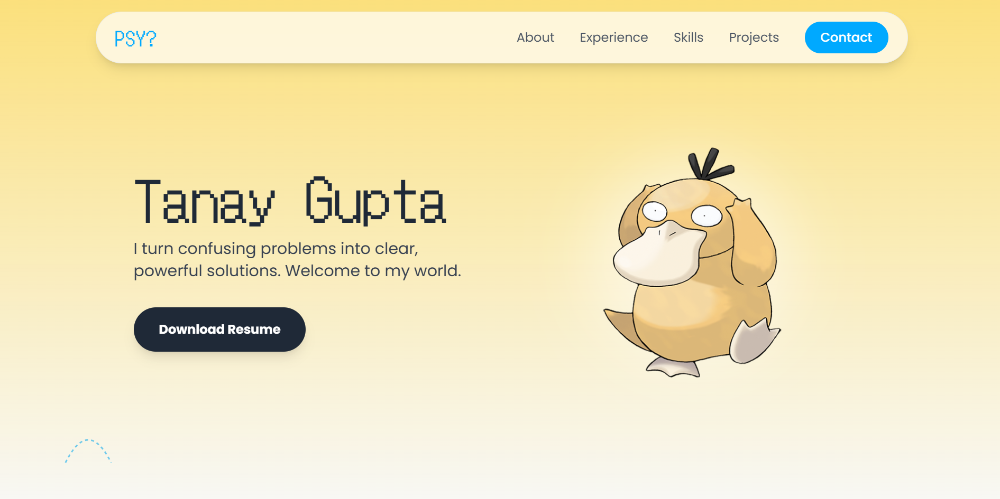

# Tanay Gupta | Psyduck-themed Portfolio


<p align="center">
  
  <br>
  <em>Desktop View</em>
</p>
<br>
<p align="center">
  
  <br>
  <em>Mobile View</em>
</p>


This is a portfolio website built using React + Vite.

**[➡️ View the Live Site](https://psyduck-devfolio.vercel.app/)**

---

## 🚀 Getting Started

Want to run this project locally? Follow these simple steps.

### Prerequisites

* Node.js (v18.x or higher)
* npm or yarn

### Installation & Setup

1.  **Clone the repository:**
    ```bash
    git clone [https://github.com/your-username/your-repo-name.git](https://github.com/your-username/your-repo-name.git)
    ```

2.  **Navigate to the project directory:**
    ```bash
    cd your-repo-name
    ```

3.  **Install the dependencies:**
    ```bash
    npm install
    ```

4.  **Start the development server:**
    ```bash
    npm run dev
    ```

Open [http://localhost:5173](http://localhost:5173) (or whatever port is shown in your terminal) in your browser to see the portfolio in action.

---

## 💬 Let's Connect

If you have a project or a problem that's giving you a headache, let's talk.

* **LinkedIn:** [https://www.linkedin.com/in/tanay-gupta/](https://www.linkedin.com/in/tanay-gupta/)
* **GitHub:** [https://github.com/Tanay-Gupta](https://github.com/Tanay-Gupta)

---
